# BitChat: Decentralized Messaging Over Bluetooth Mesh

## Abstract

BitChat is a peer-to-peer messaging app that works without internet, cell towers, or any infrastructure. Using Bluetooth Low Energy (BLE) mesh networking and the Noise Protocol Framework, it provides secure, private communication anywhere people gather.

## Core Innovation

BitChat combines three key technologies:
1. **Bluetooth mesh networking** for infrastructure-free communication
2. **The Noise Protocol** for encryption
3. **Ephemeral peer IDs** for enhanced privacy

## How It Works

### The Mesh Network

```mermaid
graph TD
    A[Alice 📱] -.->|BLE 30m| B[Bob 📱]
    B -.->|BLE 30m| C[Carol 📱]
    C -.->|BLE 30m| D[Dave 📱]
    
    A -->|"Message to Dave<br/>hops through network"| B
    B --> C
    C --> D
    
    style A fill:#4caf50,color:#fff
    style D fill:#2196f3,color:#fff
```



Each phone acts as both a sender and relay, creating a network that extends far beyond individual Bluetooth range. Messages hop from phone to phone until they reach their destination.

### Security Architecture

BitChat uses the **Noise XX** handshake pattern for end-to-end encryption:


This provides:
- **Forward secrecy**: Past messages stay secure even if phones are compromised
- **Identity hiding**: User identities are encrypted during connection
- **Authentication**: Messages can't be forged or tampered with

### Privacy Through Rotation

BitChat introduces **ephemeral peer ID rotation**:


- Peer IDs change periodically (random intervals 5-15 minutes)
- Public key fingerprints remain constant for friends/verification
- Prevents tracking while maintaining secure relationships

## Key Features

### 1. No Infrastructure Required
- Works in subways, protests, disasters, remote areas
- No servers, no internet, no cell towers
- Completely peer-to-peer

### 2. Secure by Design
- End-to-end encryption for all private messages
- Password-protected channels with derived keys
- Digital signatures prevent impersonation

### 3. Privacy First
- No phone numbers or email addresses
- No account creation or registration
- Ephemeral messages (not stored on disk by default)
- Rotating peer IDs prevent tracking

### 4. Intelligent Mesh
- Messages automatically find the best path
- Store-and-forward for offline recipients
- Adaptive TTL prevents network flooding
- Battery-aware operation modes

## Message Flow

```mermaid
graph TD
    U[User Types Message] --> E[Encrypt with Noise]
    E --> F{Size Check}
    F -->|"> 500 bytes"| FR[Fragment Message]
    F -->|"≤ 500 bytes"| P[Package for Send]
    FR --> P
    
    P --> B[Broadcast via BLE]
    B --> M{Recipient Online?}
    
    M -->|Yes| D[Direct Delivery]
    M -->|No| S[Store & Forward]
    
    S --> W[Wait for Recipient]
    W --> D
    
    style U fill:#e3f2fd
    style E fill:#f3e5f5
    style D fill:#c8e6c9
```



## Real-World Applications

### Emergency Communication
- Natural disasters when cell towers fail
- Building collapses with trapped people
- Remote areas without coverage

### Privacy-Critical Scenarios
- Protests and demonstrations
- Journalist source protection
- Corporate confidential meetings

### Everyday Use
- Subway commutes
- Crowded events
- International travel without roaming

## Technical Advantages

### Over Traditional Messaging
- **No metadata collection**: ISPs/governments can't track who talks to whom
- **Censorship resistant**: No central servers to block
- **Location private**: No GPS or location data required

### Over Other Mesh Solutions
- **Better security**: Noise Protocol vs basic encryption
- **Identity management**: Verification persists across ID rotation  
- **Channel system**: Topic-based groups with access control

## Implementation Highlights

### Efficient Binary Protocol
- Minimal overhead (26-byte header)
- Automatic compression for large messages
- Fragment support for reliability

### Smart Battery Management
```
High Battery: Maximum performance, all features active
Medium Battery: Balanced mode, slight duty cycling  
Low Battery: Power saving, reduced connections
Critical Battery: Emergency mode, minimal operation
```

### Store & Forward System
- 12-hour cache for regular messages
- Unlimited retention for favorite contacts
- Automatic delivery when peers reconnect

## The Future

BitChat is designed for extensibility:

- **Alternative transports**: WiFi Direct, ultrasonic, LoRa
- **Network bridges**: Optional internet gateways (Nostr integration)
- **Post-quantum crypto**: Ready for quantum-resistant algorithms

## Conclusion

BitChat proves that secure, private communication doesn't require billion-dollar infrastructure. By combining time-tested protocols with innovative privacy features, it returns control of digital communication to users.

The entire project is open source and released into the public domain - because permissionless tools belong to everyone.

---

*Download BitChat: [bitchat.free](https://bitchat.free)*

*This document is released into the public domain under The Unlicense.*
